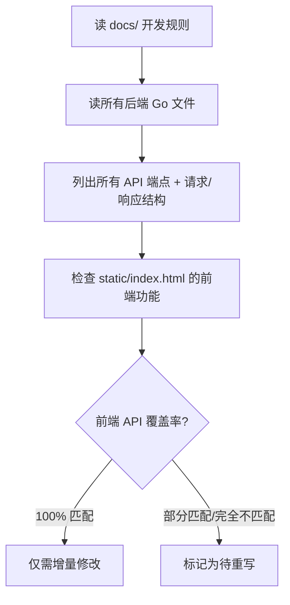

# Gin + Vue 3 SPA 项目构建/重构模式

适用于从其他技术栈（如 .NET WinForms/WPF）提取并重构为 Go Gin 项目的场景，尤其是遵循"参考项目复用"策略的 monorepo/小项目。

## 核心流程

### 1. 全面分析（先不动代码）

在动手前，必须系统地评估当前状态：



**检查清单：**
- [ ] 读取 `docs/` 目录下的所有文档，理解项目目标
- [ ] 读取 `go.mod` 了解 Go 版本和依赖
- [ ] 读取 `main.go` 列出所有路由（`r.GET/POST/DELETE` 等）
- [ ] 读取每个 handler 的请求结构体（`var req struct{...}`）和响应 JSON 字段
- [ ] 读取 `static/index.html` 的前端 API 调用代码（`fetch`/`API.*` 调用）
- [ ] **对照检查**：前端调用的每个 API 端点是否与后端实际提供的完全一致

### 2. 修复编译错误

Go 编译器不会说谎。最常见的问题：

#### a. `go:embed` 路径问题

`go:embed` 的路径是**相对于源文件目录**的，不是模块根目录。

```go
// main.go 在 cmd/llm-tester/main.go
//go:embed static              // 错误！会在 cmd/llm-tester/ 下找 static/
var staticFS embed.FS
```

✅ **修正：** 将 `static/` 目录放到 `cmd/llm-tester/static/` 下，或把 `main.go` 移到模块根目录。

> **原因：** `go:embed` 不支持 `../` 相对路径。

#### b. 同字段异构体类型转换

当两个 package 定义了字段完全相同的结构体（如 `storage.Config` 和 `llm.Config`），**不能直接强制转换**——Go 要求结构体来自同一个类型定义。

```go
// 编译错误：不能将 *storage.Config 转为 *llm.Config
provider := llm.NewProvider((*llm.Config)(&req.Config))
```

✅ **修正：** 在调用方（`main.go`）添加转换函数：

```go
func toLLMConfig(cfg *storage.Config) *llm.Config {
    return &llm.Config{
        APIType:      cfg.APIType,
        BaseURL:      cfg.BaseURL,
        // ... 逐字段映射
    }
}
```

> **原则：** 不在 `storage` 包中引入对 `llm` 包的依赖（避免不必要的耦合），转换放在 `main.go` 中。

#### c. 未使用的导入

重构后可能遗留未使用的 import，`go build` 会报错。用 `go vet ./...` 做全面检查。

### 3. 实现前端：单文件 Vue 3 SPA

遵循参考项目 `token-refresher-gui` 的模式：

#### 架构模式

```
cmd/llm-tester/
├── main.go             # Gin 路由 + go:embed static
├── static/
│   └── index.html      # 单文件 Vue 3 SPA（无构建步骤）
```

#### 模板代码结构

```html
<!DOCTYPE html>
<html lang="zh-CN">
<head>
  <!-- 内联 CSS：紧凑型 UI，颜色变量 -->
</head>
<body>
  <div id="app">
    <!-- Header：标题 + 版本号 -->
    <!-- Tab Bar：功能标签页 -->
    <!-- Main Content：当前 tab 的内容 -->
    <!-- Log Panel（右侧）：自动轮询日志 -->
  </div>

  <script type="module">
    import { createApp, ref, ... } from 'https://unpkg.com/vue@3/dist/vue.esm-browser.js';

    // API 封装
    const API = {
      async get(url) { ... },
      async post(url, body) { ... },
    };

    createApp({ setup() { ... } }).mount('#app');
  </script>
</body>
</html>
```

#### 关键实现要点

| 主题 | 说明 |
|------|------|
| **Vue 3 ESM** | 直接从 CDN 加载，无 Webpack/Vite 构建步骤 |
| **API 封装** | 统一 `API.get/post` 函数，处理 Content-Type |
| **SSE 流式响应** | 用 `fetch` + `ReadableStream` 读取 `data:` 行，JSON 解析 |
| **日志轮询** | `setInterval(pollLogs, 2000)` 配合 `nextTick` 自动滚动 |
| **日志样式化** | 根据日志内容特征词（✅/❌/💾）自动着色 |
| **紧凑 UI** | 使用 CSS 变量统一主题，左内容+右日志双栏布局 |
| **响应式** | 小屏幕隐藏右侧日志面板 |

#### SSE 流式处理模板

```javascript
async function runSSETest() {
  const r = await fetch('/api/test/xxx', {
    method: 'POST',
    headers: { 'Content-Type': 'application/json' },
    body: JSON.stringify(payload),
  });
  const reader = r.body.getReader();
  const decoder = new TextDecoder();
  let buf = '';

  while (true) {
    const { done, value } = await reader.read();
    if (done) break;
    buf += decoder.decode(value, { stream: true });
    const lines = buf.split('\n');
    buf = lines.pop() || '';
    for (const line of lines) {
      if (!line.startsWith('data: ')) continue;
      const data = JSON.parse(line.slice(6));
      if (data.type === 'done') { /* 完成 */ }
      else { results.value.push(data); }
    }
  }
}
```

### 4. 后端 API 设计模式

Gin 路由参考结构：

```go
r := gin.New()
r.Use(gin.LoggerWithConfig(gin.LoggerConfig{
    SkipPaths: []string{"/api/test/benchmark", "/api/test/burn"},
}))

// 配置管理
r.GET("/api/configs", handleListConfigs)
r.POST("/api/configs", handleSaveConfig)
r.DELETE("/api/configs/:name", handleDeleteConfig)

// 测试 API
r.POST("/api/test/connection", handleTestConnection)
r.POST("/api/test/chat", handleChat)
r.POST("/api/test/batch", handleBatchTest)    // SSE
r.POST("/api/test/benchmark", handleBenchmark) // SSE

// 日志
r.GET("/api/logs", handleLogs)
r.DELETE("/api/logs", handleClearLogs)

// SPA fallback
r.NoRoute(func(c *gin.Context) {
    if !strings.HasPrefix(c.Request.URL.Path, "/api/") {
        serveIndex(c)
    }
})
```

### 5. 验证清单

- [ ] `go build ./cmd/<name>/` 无错误
- [ ] `go vet ./...` 无警告
- [ ] 启动服务器：API 返回正确 JSON
- [ ] 前端加载：`curl http://localhost:8912/` 返回 HTML
- [ ] SPA 路由：所有非 `/api/` 路径都返回 `index.html`
- [ ] 核心 CRUD 流程可走通

## 常见陷阱

1. **Vue 3 的 `reactive` vs `ref`**：对于深层对象的表单编辑，用 `reactive` 更方便；`ref` 需要 `.value` 访问
2. **SSE 缓冲**：Go 的 `c.Writer.Flush()` 需要设置 `Content-Type: text/event-stream`，否则 Gin 会缓冲整个响应
3. **CORS**：如果前后端分离（不同端口），需要 `gin-contrib/cors`；单文件 embed 模式不需要
4. **Vue 3 CDN 版本**：使用 `vue.esm-browser.js`（支持 `type="module"`），不要用 `vue.global.prod.js`（需要全局 `<script>`）